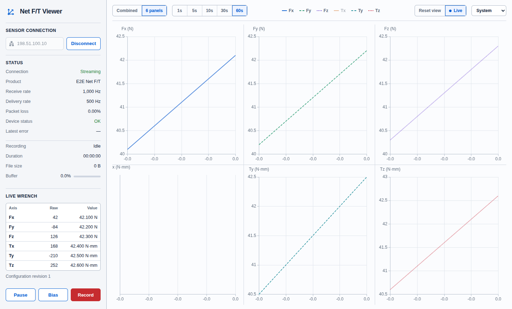

# Net F/T Viewer

[](https://github.com/netft/netft-viewer/actions/workflows/ci.yml)
[](https://github.com/netft/netft-viewer/actions/workflows/codeql.yml)
[](https://codecov.io/gh/netft/netft-viewer)
[](https://github.com/netft/netft-viewer/releases)
[](LICENSE)

Net F/T Viewer is a cross-platform desktop application for connecting directly to one ATI Net F/T sensor, inspecting its six-axis wrench in real time, and recording calibrated data without a ROS installation.



## Highlights

- See raw counts and calibrated force and torque together with the units and calibration reported by the sensor.
- Switch between a combined plot and six individual panels, choose a 1–60 second window, and show or hide any axis.
- Pause the displayed measurements and CSV capture without stopping the sensor connection or health monitoring.
- Record every accepted sample through a bounded 65,536-sample memory buffer, with explicit overflow handling and recoverable partial files.

## Supported platforms

| Platform | Architecture | Install artifacts |
| --- | --- | --- |
| Linux | x86_64, ARM64 | `.deb`, portable `.tar.gz` |
| Windows | x86_64 | Setup `.exe`, portable `.zip` |
| macOS | Intel and Apple silicon | Universal `.dmg`, universal `.zip` |

Each GitHub release also includes `SHA256SUMS` and an SPDX JSON software bill of materials. Packaging is tested on Ubuntu 24.04, Windows Server 2025, and macOS 15 runners.

## Install and run

Download the artifact for your platform from [GitHub Releases](https://github.com/netft/netft-viewer/releases).

On Linux, install the Debian package with:

```bash
sudo apt install ./netft-viewer_0.1.0_amd64.deb
```

Alternatively, extract the portable archive and run `netft-viewer`. On Windows, run `NetFTViewerSetup.exe` or extract the ZIP. On macOS, open the DMG and drag Net F/T Viewer to Applications, or extract the universal ZIP.

To build from source, install Node.js 24, pnpm 11.17.0, CMake 3.21 or newer, Ninja, a C++17 compiler, and the platform packaging tools listed in [CONTRIBUTING.md](CONTRIBUTING.md):

```bash
pixi install
pnpm install --frozen-lockfile
pixi run native-configure
pixi run native-build
pnpm run start
```

## Connect to a sensor

Connect the computer and sensor to the same trusted network, configure a compatible IPv4 address on the computer, enter the sensor address, and select **Connect**. ATI sensors use `192.168.1.1` as their documented default address; use the address configured for your device if it has been changed.

The sidebar reports connection state, product name, receive and delivery rates, packet loss, device status, the latest error, recording progress, and buffer use. The Live wrench table shows Fx, Fy, Fz, Tx, Ty, and Tz as both integer counts and calibrated values. Force and torque units come from the sensor configuration rather than from viewer defaults.

The chart toolbar provides:

- **Combined** and **6 panels** layouts.
- 1, 5, 10, 30, and 60 second time windows.
- Per-axis visibility controls.
- **Live** to return to the newest data and **Reset view** to clear chart zoom and pan.

## Pause, Bias, and record

**Pause** freezes live numeric values and plots, drains and flushes accepted CSV samples, and then suspends CSV acceptance. The connection and health counters continue running. **Resume** restarts display updates and CSV acceptance; paused samples are not replayed into either view.

**Bias** asks for confirmation before sending the zero command and is unavailable while paused. Remove all load from the transducer and make sure zeroing is safe for the mechanism before confirming.

**Record** opens a save dialog and writes CSV data asynchronously. A preallocated 65,536-sample queue isolates the sensor callback from disk latency. The viewer never silently discards an accepted row: queue overflow or a write failure ends the recording with an explicit error. During recording, data is first written to `<name>.csv.partial`; a clean stop flushes every accepted row and atomically promotes it to the selected `.csv` path. If the application or storage fails, keep the partial file for recovery and inspect the final complete rows with a text or CSV tool.

## Network security

ATI Net F/T configuration and RDT streaming use unauthenticated HTTP and UDP. Use the viewer only on a trusted, access-controlled sensor network; do not expose the sensor directly to the public internet or an untrusted wireless network. The viewer stores display preferences locally but does not store sensor credentials.

## Troubleshooting

### The viewer cannot connect

Confirm that the sensor is powered, the host network interface is in the same IPv4 subnet, and the sensor address is correct. Check local firewall rules for outbound HTTP and UDP traffic and inbound RDT replies on the negotiated socket. A browser request to the sensor configuration page can help distinguish HTTP reachability from streaming problems.

### Values appear but the units or scale are wrong

Disconnect, verify the active calibration on the sensor, and reconnect so the viewer discovers the authoritative counts and units again. The configuration revision in the sidebar changes when the sensor reports a new calibration.

### Packet loss or reconnects increase

Use a wired connection, remove congested switches or wireless bridges from the sensor path, and check the receive and delivery rates. Pause does not reduce sensor traffic; disconnect when streaming is no longer required.

### A `.partial` file remains

The recording did not finish its verified promotion. Preserve the file, inspect its complete CSV rows, verify available disk space and permissions, and start a new recording with a new destination. The viewer does not overwrite a partial file silently.

## Contributing and security

See [CONTRIBUTING.md](CONTRIBUTING.md) for development and pull request guidance. Report vulnerabilities through the private process in [SECURITY.md](SECURITY.md), not a public issue.

Net F/T Viewer is licensed under the [Apache License 2.0](LICENSE). Bundled dependency notices are in [THIRD_PARTY_NOTICES.md](THIRD_PARTY_NOTICES.md).

<sub>Community-maintained software; not affiliated with, endorsed by, or supported by ATI Industrial Automation.</sub>
