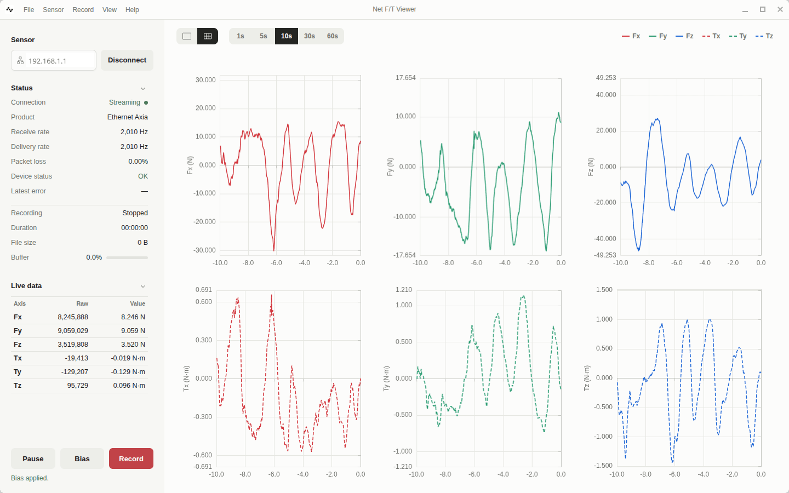

# Net F/T Viewer

Net F/T Viewer is a cross-platform desktop application for inspecting and
recording live six-axis data from an ATI Net F/T Ethernet sensor without a ROS
installation.

## Features

- Shows raw counts and calibrated force and torque in sensor-reported units.
- Switches between one combined plot and six individual panels.
- Tracks connection state, receive rate, packet loss, status, and recording.
- Pauses display and CSV capture without losing connection-health monitoring.
- Records through a bounded buffer with explicit overflow and recovery behavior.

## Installation

Download the latest installer or portable archive from
[GitHub Releases](https://github.com/netft/netft-viewer/releases).

| Platform | Architecture | Artifacts |
| --- | --- | --- |
| Linux | x86-64, ARM64 | `.deb`, portable `.tar.gz` |
| Windows | x86-64 | Setup `.exe`, portable `.zip` |
| macOS | Intel and Apple silicon | Universal `.dmg`, universal `.zip` |

## Quick start

1. Connect the computer and sensor to the same trusted network.
2. Configure the computer with a compatible IPv4 address.
3. Start Net F/T Viewer, enter the sensor address, and select **Connect**.
4. Inspect the live values and health indicators before recording or biasing.

ATI sensors use `192.168.1.1` as their documented factory-default address. Use
the address configured for your device if it has been changed.

## Documentation

- [Connect and inspect](https://netft.dev/docs/tutorials/viewer/connect-and-inspect)
- [Record and review](https://netft.dev/docs/tutorials/viewer/record-and-review)
- [Troubleshooting](https://netft.dev/docs/tutorials/troubleshooting/)
- [Security and safety](https://netft.dev/docs/references/security-and-safety)

Pause freezes the displayed data and suspends CSV acceptance while connection
health continues to update. Bias changes the measurement zero; unload or
fixture the sensor and make the connected mechanism safe before confirming it.

## Contributing

See [CONTRIBUTING.md](CONTRIBUTING.md) for development setup and pull-request
guidance. Report security issues through [SECURITY.md](SECURITY.md).

## License

Net F/T Viewer is licensed under the [Apache License 2.0](LICENSE). Required
third-party license and notice texts are distributed in [LICENSES](LICENSES).

## Recording metadata (unreleased candidate)

After successful data finalization, the candidate writes `<output>.metadata.json` using schema version 1 and kind `netft-recording`. CLI and Viewer share these meanings:

| Field | Meaning |
| --- | --- |
| `producer`, `result` | `netft-cli` or `netft-viewer`; `complete` or CLI `interrupted` after a successful nonempty drain. |
| `accepted_samples`, `written_samples` | Samples accepted into the recording queue and rows successfully written. These are not power-loss durability guarantees. |
| `sample_span_seconds` | Nonnegative host receive-time span between first and last written sample; zero for fewer than two samples. |
| `configuration_revisions` | Unique revision identifiers in written rows, scoped to the producer session. They do not contain full calibration snapshots. |
| `force_units`, `torque_units` | Unique native unit symbols observed in written rows. |
| `recorded_rdt_gaps` | Sum of forward sequence gaps between written rows, using unsigned wraparound and ignoring backward jumps. Pauses, rate filtering and reconnects can contribute; this is not the SDK packet-loss counter. |
| `pause_count` | Accepted Viewer pauses; CLI has no pause operation and reports zero. |
| `reconnect_count` | CLI SDK reconnect counter for the run; `null` for Viewer because its recorder does not own connection health. |
| `error` | `null` on successful finalization. Failure details remain in the CLI error or Viewer recorder state. |

Partial or failed captures do not receive a completed summary. Metadata creation and promotion follow the data file's overwrite policy. The two files are finalized separately: a metadata failure reports an error and preserves the completed data file, and may leave a metadata partial for recovery. Keep both files when archiving a successful capture.

The CLI candidate appends `configuration_revision` to CSV without moving existing columns and adds it inside the NDJSON sample object. Viewer already records revisions in each CSV row. Existing published releases retain their documented formats until these changes are released.
